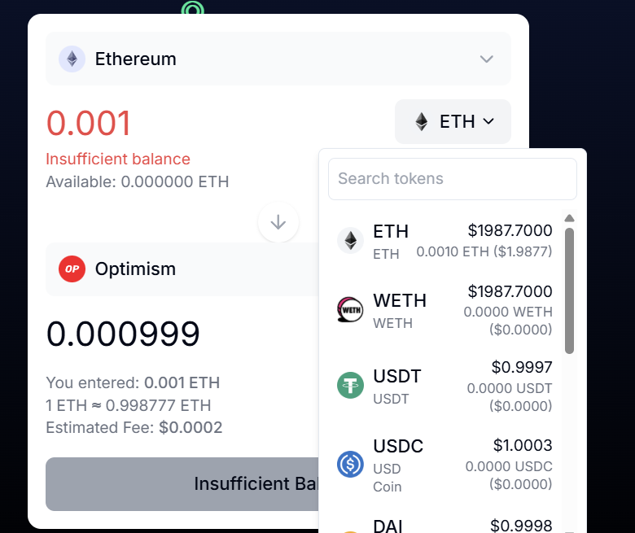

# xBRIDGE

## About xBRIDGE

xBRIDGE is a revolutionary DeFi protocol that enables atomic swap-bridge execution, allowing users to conduct token swaps and cross-chain transfers in a single transaction. In the current cryptocurrency ecosystem, users typically need to execute separate transactions for swapping tokens and bridging them across different blockchains, resulting in higher gas fees, increased complexity, and elevated risk exposure.

xBRIDGE solves this universal problem by leveraging EIP-2535's Diamond Standard to create a modular, gas-optimized smart contract architecture that combines swapping and bridging into one seamless operation. This atomic execution not only reduces costs but also improves security by eliminating intermediate states where funds could be vulnerable.

Powered by the Li.Fi protocol and Diamond Cut contracts, xBRIDGE offers:

- **Gas Savings**: Up to 40% gas reduction compared to traditional proxy methods
- **Reduced Risk**: Eliminating the gap between swap and bridge transactions
- **Simplified UX**: One transaction instead of multiple complex operations
- **Cross-chain Interoperability**: Seamless movement between EVM-compatible chains

## Vision

Our vision for xBRIDGE is to eliminate the fragmentation that exists in the current DeFi landscape and provide a unified, efficient, and secure solution for cross-chain token transfers. We aim to:

1. **Solve the $1.2B/year "Gas Graveyard" Problem**: By optimizing the swapping and bridging process, we can help users and the ecosystem reclaim billions in wasted gas fees.

2. **Simplify Cross-chain Operations**: Make interoperability between blockchains as simple as using a single chain, lowering the technical barriers that prevent wider DeFi adoption.

3. **Create a Modular, Upgradeable Protocol**: Our implementation of the Diamond Standard allows for continuous improvement and addition of new features without disrupting existing functionality.

4. **Support All EVM Chains**: Provide comprehensive coverage for the Ethereum ecosystem and all EVM-compatible chains.

5. **Enhance Security Through Atomicity**: Protect users' funds by ensuring that complex cross-chain operations either complete fully or revert entirely, eliminating partial execution risks.

## Screenshots

### xBRIDGE Main Interface


### Wallet Connection


### Swap Interface


### Token and Chain Selection


### Crypto Market Overview


### Transaction Success


### Etherscan Verification


## Technical Architecture

xBRIDGE is built on three key technical innovations:

1. **EIP-2535 & Diamond Cut**: Our modular smart contract design allows dynamic addition/removal of logic (swap/bridge modules) without storage collisions.

2. **Zero Proxy Jumps**: Direct delegatecall to facets reduces gas by 40% compared to traditional proxies.

3. **Atomic Execution**: All-in-one transaction execution via Li.Fi's route aggregation, enforced by Diamond's shared storage.

This architecture enables gas-optimized, secure, and flexible execution of cross-chain operations that would otherwise require multiple separate transactions.

**Contract Address**: 0x45f15e62cC71b8aba7b133D7A08CC1E14D7fa218

## Getting Started

1. Setup
2. Connect your wallet (MetaMask, WalletConnect, Coinbase Wallet, etc.)
3. Select your source chain and token
4. Select your destination chain and token
5. Set the amount to swap and bridge
6. Click "Swap" to execute the transaction in one go

## Local Development Setup

### Prerequisites

- Node.js (v16.x or later)
- npm (v8.x or later) or yarn (v1.22.x or later)
- Git

### Installation

1. Clone the repository:
   ```bash
   git clone https://github.com/xbridge/xbridge.git
   cd xbridge
   ```

2. Install dependencies:
    ```
    npm install
    # or
    yarn install
    ```

3. Set up environment variables:
    ```
    cp .env.example .env
    ```
    Edit the .env file and add your API keys and configuration values.

4. Compile smart contracts:
    ```
    npx hardhat compile
    ```

5. Run local development node:
    ```
    npx hardhat node
    ```
6. Deploy contracts to local network (in a new terminal):
    ```
    npx hardhat run scripts/deploy.js --network localhost
    ```

7. Start the frontend development server:
    ```
    npm run dev
    # or
    yarn dev
    ```

8. Open your browser and navigate to http://localhost:3000